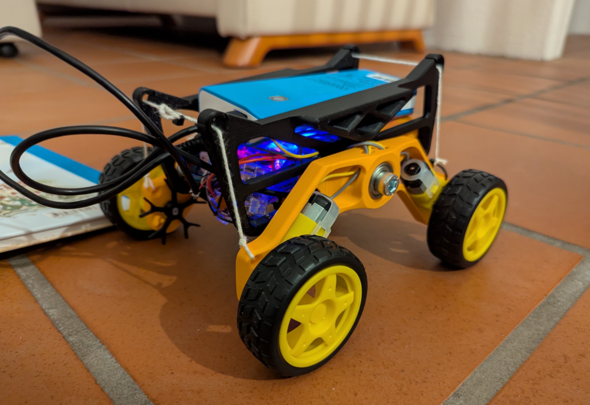

# RollingRobot

RollingRobot is an ESP32-based off-road rover that you drive with an old Google Stadia controller over Bluetooth using Bluepad32. The firmware controls four DC motors (arcade drive) via an L298N motor driver, blinks status LEDs, and plays simple sounds on a speaker salvaged from an old DECT phone and driven by PWM. Power comes from a repurposed power bank. The 3D-printed parts are available here: https://www.printables.com/model/164264-off-road-robotics-platform-rovers

